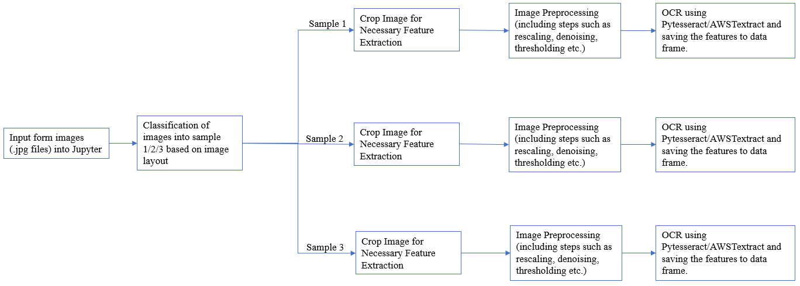
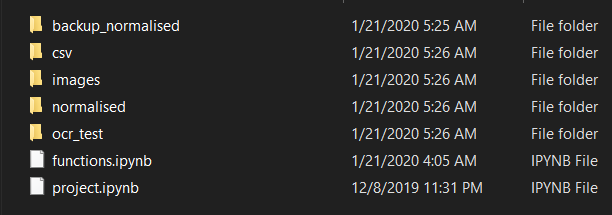
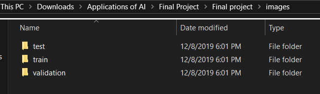
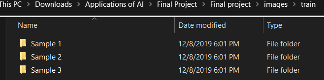
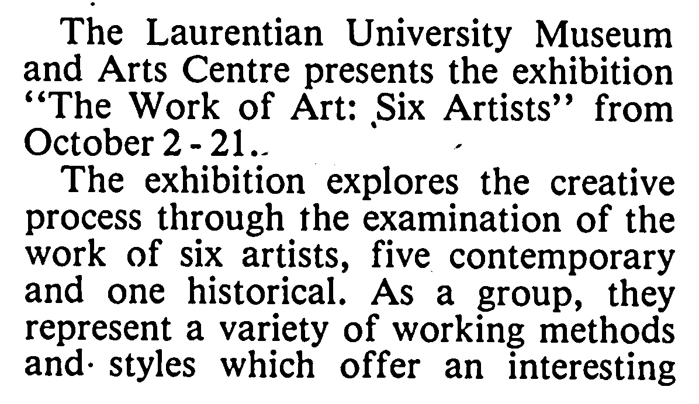
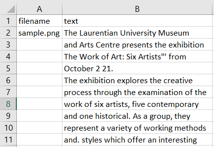
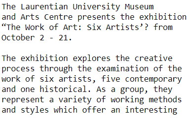

# Image Classification and Text Extraction

One of the most significant applications of Artificial Intelligence is Optical Character Recognition. This phenomenon is defined as the process of scanning text into an image from an image/form/paper and translating the images obtained into a system manipulatable form. This is highly useful in applications where an archive of form data has to be manipulated and features in these forms are to be extracted and stored into a data frame. On an extension such OCR can be used in financial institutions to analyze cheques, credit cards, in healthcare providing systems to maintain patient databases from forms and so on. 

### Project Objective

The project objective is similar to the process mentioned above. Based on any kind of images, which are multiclass in nature, OCR can be performed on these images depending upon the class.

Initially, we are to classify the images based on their feature or layout such as printed or handwritten images. After this classification, the computer performs feature extraction from the image and the model’s efficiency depends on how clear we input the image to the computer so that the features are properly extracted. For this purpose, we perform certain process on the images such as cropping, normalization, Gaussian filtering and so on depending upon the type of the image obtained as output from the classification.

### Tools Required

This project requires **Python 3** and the following Python libraries installed:

- [AWS Textract Package](https://docs.aws.amazon.com/textract/latest/dg/setup-awscli-sdk.html)
- [Pytesseract Package](https://github.com/UB-Mannheim/tesseract/wiki)
- [Keras package for CNN](https://keras.io/)
- [Pillow package for image preprocessing](https://pypi.org/project/Pillow/)
- [OpenCV package for image preprocessing](https://pypi.org/project/opencv-python/)

Make sure you have [Jupyter Notebook](http://ipython.org/notebook.html) installed.

You could just install [Anaconda](http://continuum.io/downloads) distribution of Python, which already has the above packages and more included. 

For running the AWS Textract API locally follow the link mentioned above. You need to have an AWS account to run the AWS Textract, if you don't have it, you can use Pytesseract package and follow the link mentioned for the same. But the accuracy for AWS Textract is way better than Pytesseract.

### Project Workflow



### Process

There are two notebooks project.ipynb and functions.ipynb, project.ipynb is the main notebook and functions.ipynb contains all the functions which are imported in the project notebook. Both the notebooks should be stored in the same location. The entire process from image classification to text extraction is automated and you just need to run a function, 'ocr_process(basepath)' from the project notebook. Pytesseract function is present in the function notebook.

For the process to be automated, there is folder structure which needs to be maintained, the folder structure is shown below, 



* Ocr_test folder contains the images that we stream into the machine to perform classification and OCR
* Normalized folder contains the images that have been normalized after preprocessing
* Csv folder contains the output data frame of the features present in the input forms.
* Images folder contains 3 subfolders Train, Test, Validation
* Each folder contains 3 subfolders Sample 1, Sample 2 & Sample 3 (depending upon your multiclass images)





* This file management of images is done to train our CNN model for classification of images into the respective samples based on their layout
* After classification of images, preprocessing of image is done by gray scaling, cropping, thresholding using Gaussian Blurring etc (depending upon the image)
* Once the image is normalized, separate function is used to perform OCR and extract features of the image into a data frame which is then saved as a .csv output using AWS Texteract.

### Run

In a terminal or command window, navigate to the top-level project directory (that contains this README) and run one of the following commands:

```bash
ipython notebook project.ipynb
```  
or
```bash
jupyter notebook project.ipynb
```

This will open the Jupyter Notebook software and project file in your browser.

### Output

Let's take a sample file called as, sample.png (the sample file is placed in the data folder)


Let's say the classification is done, and let's consider this image as printed image. The preprocessing is done and the output of the preprocessed image is shown below,



The output in the CSV file,



The pytesseract output,



### Contributing
Pull requests are welcome. For major changes, please open an issue first to discuss what you would like to change.

Please make sure to update tests as appropriate.


